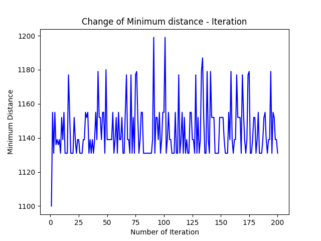

# Inventory-routing-problem-with-modified-Any-Colony-Algorithm
This is implepentation of this [Research Paper](https://drive.google.com/file/d/1zA70COwq458tK2xrlB3gcoE5LGdFI3B-/view?usp=sharing)

### Quick Guide
1. Open `git bash` and paste and clone the repositoryn  
```git clone https://github.com/surjendu104/Inventory-routing-problem-with-modified-Any-Colony-Algorithm-.git```

2. Open the file in terminal
3. Run  
```py plot_result.py```

### Output
Output will be store in `output.txt` and plotting result will be shown in  `output.png`  
The plot is of `Number of Iteration` vs `Minimum Distance`
Here's one sample Plot Result 

  

